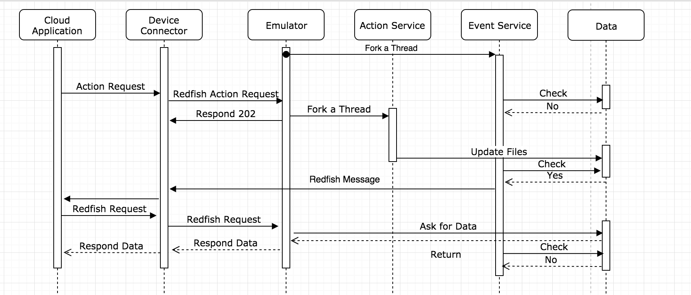
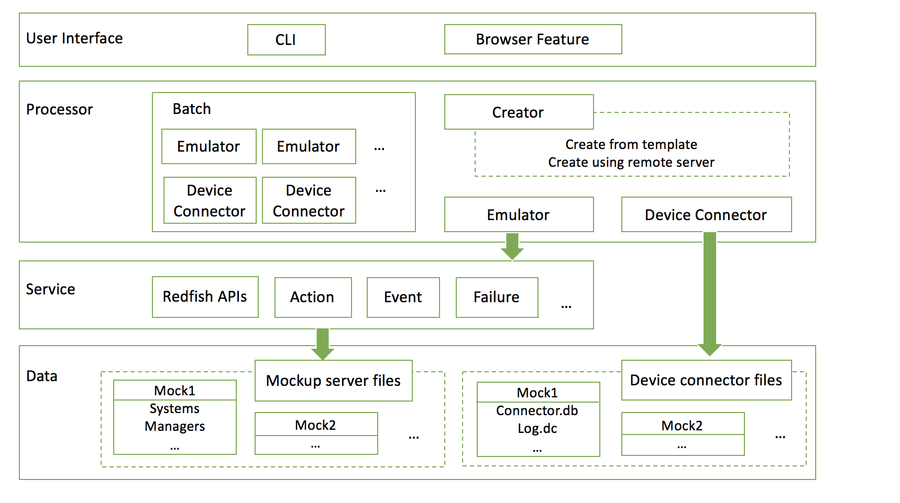

Redfish Emulator Developer Manual
===

This document is for developer who wants to 
    1. Define new actions 
    2. Know implement details of the emulator
    3. Make code changes 

Create new actions: Action Specification
---

There are two ways for user to define a new action
1. Code the action behaviour in `./service/ActionService`
2. Add an object in `./config/action.json` by specifying the following attributes
    1. NAME: this should be a unique identifier for each action
    2. ARGS: a list of arguments that can be replaced by real values during Redfish request 
    3. TARGET: the action's URL, which contains one or more args wrapped in `<>`.
    4. ACTIONS: a list of tasks depending on http pay load. 
        1. CONDITIONS: http pay load. Multiple key-values are separated by ',', e.g. `Mode=config,PowerState=on`
        2. CHANGES: a list of file changes. Note that '&' serves as the separator between url and attribute,
                    and ',' are used to define nested attribute. Support you want to change manager `{'Status':{'Health':'OK'}}`
                    to `{'Status':{'Health':'WARNING'}}`, then define `/redfish/v1/Managers/<manager>&Status,Health=WARNING`
        3. DELAY: The delay time for action to complete
        
**Example 1**

Consider the following action to config a server's GPU mode

| Task or Operation        | Action URL           | Http Payload  |
|:-------------:|:-------------:|:-----:|
|  Change the GPU mode to compute    | /redfish/v1/Systems/FCH2102J063/Oem.GraphicsCards /0330317021767/Actions/GraphicsCard.ConfigMode| {"Mode": "compute"} |
|  Change the GPU mode to graphic    | /redfish/v1/Systems/FCH2102J063/Oem.GraphicsCards /0330317021767/Actions/GraphicsCard.ConfigMode| {"Mode": "graphics"} |


You can add the following json object to `./config/action.json`.
```json

  {
    "NAME": "GraphicsCards",
    "ARGS": [
      "system_id", "graphic_id"
    ],
    "TARGET": "/redfish/v1/Systems/<system_id>/Oem.GraphicsCards/<graphic_id>/Actions/GraphicsCard.ConfigMode",
    "ACTIONS": [
      {
        "CONDITIONS": "Mode=compute",
        "CHANGES": ["/redfish/v1/Systems/<system_id>/Oem.GraphicsCards/<graphic_id>&Mode=Compute"],
        "DELAY": 10
      },
      {
        "CONDITIONS": "Mode=graphics",
        "CHANGES": ["/redfish/v1/Systems/<system_id>/Oem.GraphicsCards/<graphic_id>&Mode=Graphics"],
        "DELAY": 10
      }
    ]
  }
```
This is equivalent to adding the following code:      
       
```python
# add to ./service/ActionService.py
class GraphicsMode(Resource):
    if g.login_required:
        decorators = [g.auth.login_required]

    def post(self, system_id, graphic_id):
    
        def do_task(filepath, mode, delay=0):
            if delay > 0:
                time.sleep(delay)
                
            failure = failureDict.get_failure("GraphicsMode")
            # action fails
            if failure:
                failureQueue.put(failure)
                logging.info("Action GraphicsMode failed")
                return

            f = open(filepath)
            index = json.load(f)
            f.close()

            if mode == "compute" and index["Mode"] != 'Compute':
                index["Mode"] = "Compute"
                f = open(filepath, 'w')
                f.write(json.dumps(index, indent=4, separators=(',', ': ')))
                f.close()

            if mode == "graphics" and index["Mode"] != "Graphics":
                index["PowerState"] = "Graphics"
                f = open(filepath, 'w')
                f.write(json.dumps(index, indent=4, separators=(',', ': ')))
                f.close()
            return

        try:
            filepath = os.path.join(g.project_path, 'resource/data', g.server_name, 'Systems', system_id,
                                    'Oem.GraphicsCards', graphic_id, 'index.json')

            req = request.get_json(force=True)
            if "Mode" not in req or req["Mode"] not in ["compute", "graphics"]:
                return error_response(code="BadRequest", message="Invalid Mode for GraphicsCard.ConfigMode")
            mode = req["Mode"]

            t = threading.Thread(target=do_task, args=[filepath, mode, 5])
            t.start()
            return {"message": "Accepted"}, 202

        except FileNotFoundError:
            return error_response(code="ResourceNotFound", message="Unsupported 'POST' object url")
        except BadRequest:
            return error_response(code="InternalError", message="Invalid JSON content")
        except KeyError:
            return error_response(code="BadRequest", message="Invalid request variable")
        except:
            logging.exception("------ Error Message -----")
            return error_response(message="Internal Server Error")
        
# add to ./command/mock.py
g.api.add_resource(GraphicsMode, '/redfish/v1/Systems/<system_id>/Oem.GraphicsCards/<graphic_id>/Actions/GraphicsCard.ConfigMode')
actionStatusDict.add_action('KVMConfig')

```

**Example 2**

Another more complicated action example: 

| Task or Operation        | Action URL           | Http Payload  |
|:-------------:|:-------------:|:-----:|
|  PnuOS boot start in config mode    | /redfish/v1/Managers/CIMC/Actions/Oem.BootMgmtOS| {"mode":"config", "powerstate":"on","keepalive":"true"} |
|  PnuOS shutdown in the config mode boot    | /redfish/v1/Managers/CIMC/Actions/Oem.BootMgmtOS | {"mode":"config", "powerstate":"off","keepalive":"false"} |


```json
  {
    "NAME": "Oem.BootMgmtOS",
    "ARGS": [
      "manager"
    ],
    "TARGET": "/redfish/v1/Managers/<manager>/Actions/Oem.BootMgmtOS",
    "ACTIONS": [
      {
        "CONDITIONS": "mode=config,powerstate=on,keepalive=true",
        "CHANGES": [ ...
        ],
        "DELAY": 10
      },
      {
        "CONDITIONS": "mode=config,powerstate=off,keepalive=false",
        "CHANGES": [ ...   
        ],
        "DELAY": 10
      }
    ]
  }
```

Notice here the payload is composite object with 3 key-value pairs. The action may take some time to happen, so we define
 a delay time of 10 seconds. Since changes are not made immediately, the code will fork a thread to perform the action,
 while the main thread returns a HTTP response.


    

Code Overview
---
**Web Framework**

The program uses [Flask-RESTful](https://flask-restful.readthedocs.io/en/latest/), an extended Flask web framework, to build REST APIs.
 With Flask, the code associates each resource path and http method to a Python method. With Flask-RESTful, the RESTful 
 resources are implemented as classes. Below are two code snaps which do the same thing with Flask and Flask-RESTful respectively.
 
 ```python
# Flask
from flask import Flask

app = Flask(__name__)

@app.route('/', methods=['Get'])
def get_resource():
    return {'hello': 'world'}
```
 
 
 
```python
# Flask-RESTful
from flask import Flask
from flask_restful import Resource, Api

app = Flask(__name__)
api = Api(app)

class HelloWorld(Resource):
    def get(self):
        return {'hello': 'world'}

api.add_resource(HelloWorld, '/')
```

**Program Flow**


The emulator starts from the Main function in run.py, by parsing the sub-command to decide what task is going to do. 
Main function then parsing the following arguments, set up global variable in g.py, and assigned the task to a script in 
command folder with arguments. 

* The `create` task creates one or more mockup servers according to a JSON config file. It first make a deep copy of `./resouce/{TEMPLATE}` fold
 to `./resource/data`, which is a skeleton of server inventory with some missing files. After that, scripts in `./resuorce` folder are called
 to fill the missing part by writing to customized resource files.
 
* The `duplicate` task starts by calling `./util/redfishMockupCreate.py` to pull all the data from remote server. The script then makes a deep copy 
of the server inventory and increments all serial numbers occurred in the inventory. It will compare the server's serial number with all other server in 
 `./resource/data` and guarantee it to be unique.

* The `mock` task starts redfish emulator. The code handles:
    1) Redfish APIs
    2) Non-Redfish path (e.g. / and /browse.html)
    3) Adding Failure Services: 
        *   Failure Service controls if an action is in working state or in failed state
    4) Adding Action Services defined in `./resource/ActionService.py`
    5) Adding Action Services actions defined by `./config/action.json` and loaded by `./resource/DynamicActionService.py`
        *   If an action is in working state,  it changes related files.
        *   If an action is in failed state, it put a failure to failureQueue, which is a thread safe queue shared with event thread.
    6) Forking a thread to monitor Redfish Events: 
        *   This daemon thread monitors the file changes by checking the timestamp of files every 10 seconds.
Once a change is noticed, it sends an event message to DC using a post request.
        *   The thread also check if there is new failures generated in past 10 seconds, by reading from failureQueue.
        If so, it will send an error message for each failure
   




* The `dcmock` task used a subprocess to start a DC instance and then start emulator. This emulator is sightly different from 
the previous one that this one also starts the event service. The event service (defined in `./resource/EventService.py`) 
checks the file changes every 10 seconds and sends messages to DC if changes are noticed. To modify the checking frequency, 
change the first argument of start_event_service in `./command/mock.py`:
    ```python
    t = threading.Thread(target=start_event_service, args=[10, args.dcport], daemon=True)
    ```


Emulator Source Tree
---




**Top-level directory layout**

    .
    ├── command                 # Scripts for sub-commands 
    ├── config                  # JSON config files
    ├── connector               # Device connector files 
    ├── resource                # Inventory data related files
    ├── service                 # Web services
    ├── templates               # Browser features
    ├── utils                   # Tools and utilities
    ├── g.py                    # Global variables 
    ├── run.py                  # Program entry point
    ├── action.py               # An independet script which controls action status
    ├── requirements.txt        # Dependency list
    └── pip_freeze_output.txt   # Dependency list
    
**Command folder**
  
    .
    ├── ...
    ├── command                     
    │   ├── batch.py                # Run all mockup redfish servers
    │   ├── create.py               # Create mockup server according to config.json    
    │   ├── dcbatch.py              # Run all mockup redfish servers instances with device connector                
    │   ├── dcmock.py               # Run one mockup redfish server along with device connector
    │   ├── duplicate.py            # Make duplication from remote server
    │   └── mock.py                 # Run one mockup redfish server
    └── ...

    
  
**Connector folder**
  
    .
    ├── ...
    ├── connector                   # Device connector files 
    │   ├── MOCK_FCH2102J064        # Device connector for server MOCK_FCH2102J064
    |   |   ├── dc.log              # Log file for MOCK_FCH2102J064
    |   |   ├── connector.db        # Database file for MOCK_FCH2102J064
    │   ├── ...                     
    │   ├── connector.db            # Hard coded database template
    │   ├── m5_cloud_connector      # Binary executable file of device connctor
    │   └── echo_server.py          # A simple echo server which prints out requests it received, for testing.
    └── ...
    
**Resource folder**

    .
    ├── ...
    ├── resource                    # Inventory data related files
    │   ├── data                    # Mockup server data files
    |   |   ├── MOCK_FCH2102J063    # Data folder for server MOCK_FCH2102J063 
    |   |   |   ├── ...
    |   |   ├── ...
    │   ├── {TEMPLATE}              # Template folder for generating server     
    │   ├── drives.py               # Script for generating drives
    │   ├── eth.py                  # Script for generating eths 
    │   ├── memory.py               # Script for generating memories 
    │   ├── network.py              # Script for generating networks 
    │   ├── processor.py            # Script for generating processors 
    │   └── storage.py              # Script for generating storages
    └── ...
  
**Service folder**

    .
    ├── ...
    ├── service                     # Service files 
    │   ├── AccountService.py       # Account service for basic http authentication
    │   ├── ActionService.py        # Action service                 
    │   ├── DynamicActionService.py # Action service to load actions from action.json
    │   ├── EventService.py         # Event Service  
    │   ├── Exception.py            # Exception
    │   ├── FailureService.py       # Failure Service   
    │   └── RedfishService.py       # Redfish APIs
    └── ...

**Template folder**

    .
    ├── ...
    ├── template                    # Browser features
    │   ├── browser.html            # HTML page for browsing redfish API      
    │   └── index.html              # index HTML page
    └── ...

**Util folder**  

    .
    ├── ...
    ├── util                        # Tools and utilities
    │   ├── redfishtoollib          # Library used by redfishMockupCreator.py
    |   |   ├── ...
    │   ├── colorer.py              # Colored log 
    │   ├── redfishMockupCreator.py # To pull data from remote server
    │   ├── responseMaker.py        # To wrap http response
    │   ├── serialGenerator.py      # To generate unique serial number
    └── ...


Device connector modification 
---

In this part, we indicate the changes made to device connector code for future development. Our goal is to make the hard-coded HTTP ports changeable from the command line.  

To do so, the first change is to add two flag variable in `./vendor/bitbucket-eng-sjc1.cisco.com/an/apollo/base/connector.go`:
    
```go
var Flag_port = flag.Int("fport", 5000,"The http hport of mockup server")
var Flag_my_port = flag.Int("port", 8889,"The http port I am ")
```

We then use the variables parsed from the command line:

1.  In `./cmd/ucs_mgmt_cloud_connector.go`, add a new attribute in `c := &base.PlatformConfig` 
    ```
        PortNumber:                       *base.Flag_my_port,
    ```
2. In `cmd/ucs_mgmt_cloud_connector.go`, find `func getBmcFru(ctx context.Context)` and change `resp, err := http.Get("http://127.0.0.1:444/redfish/v1/Systems")` to:
    ```
        resp, err := http.Get(fmt.Sprintf("http://127.0.0.1:%d/redfish/v1/Systems", *base.Flag_port)) 
    ```

3. In `./plugins/RedfishPlugin.go`, add a line in `func (p *RedfishInventory) Init()`:
    ```
        CimcIpPrefix = fmt.Sprintf("http://127.0.0.1:%d", *base.Flag_port)
    ```


