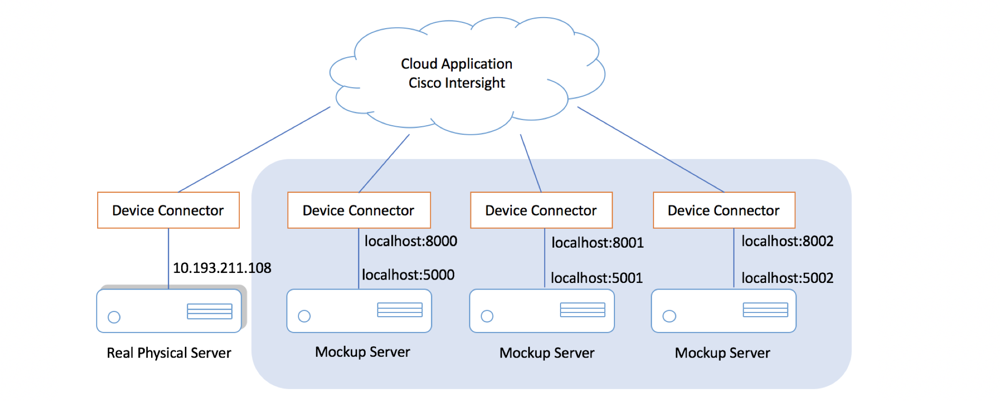
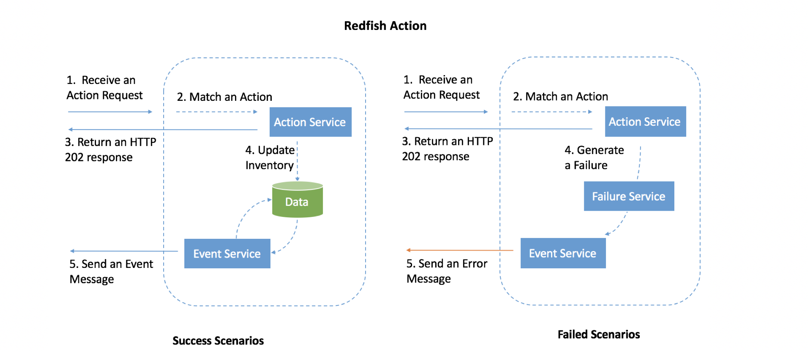

Redfish Emulator User Manual
===

Table of contents
---

<!--ts-->
   * [About](#1-about)
   * [Installation](#2-installation)
   * [Usage](#3-usage)
      * [Command Line](#command-line)
      * [Property Configuration](#property-configuration)
      * [Redfish Action Support](#redfish-action-support)
      * [Failure Simulation](#failure-simulation)
<!--te-->

1 About
---

The redfish Emulator tool can be used to emulate one or more Redfish interface servers. With redfish Emulator, the Intersight device connector can 
connect to the simulated server and get the same interface experience as real physical server. This improve flexibility and reduce the cost to 
test the Intersight, since the simulated server supports customer-defined inventory, redfish action, failure simulation, event etc.

In our implement, multiple mockup servers are running on different port. The cloud side application can connect to the simulated servers and real physical server simultaneously.
A variant of device connector is used to communicate to an mockup server. 



_(Figure1: Project Overview)_


The emulator supports the failure simulation, an Action API can behave either normally or abnormally.
* In a success scenario:

    1. The emulator receives an action request 
    2. The emulator checks if the action is defined, if so return a 202 response, 
        otherwise an error will be returned
    3. After some time, the action happened and related files are changed
    4. The Event module notices the file changes and send event messages with a URL
    of changed file
    
* In a failed scenario:

    1. The emulator receives an action request 
    2. The emulator checks if the action is defined, if so return a 202 response,
        otherwise an error will be returned
    3. After some time, the action failed and no file change will be made
    4. A failure will be passed to the Failure module
    5. The Event module notices a new failure in the Failure module and send an error message 
    
Notice in both case, the step 2 should return a 202 response. If an error is returned, it means
the action url or data you are requesting are not correct and the rest of steps won't be executed.  




_(Figure2: Action Flow Diagram)_


2 Installation
---
**2.1.Redfish Emulator Tool:**

The Redfish Emulator Tool is a python3.6 project. To run the project on your machine, a [condo virtual environment](https://conda.io/docs/user-guide/tasks/manage-environments.html) 
is recommended. The fastest way to obtain conda is to [install Miniconda](https://conda.io/docs/user-guide/install/index.html), a mini version of Anaconda. 
After conda is successfully installed, run the following command to create a virtual environment called "redfish". 
```commandline
conda create -n redfish python=3.6
source activate redfish
```
You can then install all the dependencies inside the condo virtual environment via pip.
```commandline
pip install -r requirement.txt
```
Now you're ready to run the simulated servers:
```commandline
python run.py mock
```
This will start a mockup server according to the default inventory in the directory `./resource/data/default`. 
You should have your local simulated Redfish server running on `http://localhost:5000`. Then you can either browse Redfish API 
using our browser feature at [http://localhost:5000/browse.html](), or by doing a typical Redfish request. For example, run 
`curl -X GET -k http://localhost:5000/redfish/v1` at terminal and you should our default inventory resource.

Please refer to `pip_freeze_output` if you want to know the exact version of the dependencies.

**2.2.DC(Device Connector) for Redfish Emulator:**

Originally, an intersight DC(device connector) communicates with physical server via the server's 444 port. 
To connect the simulated servers instead of the real physical servers, a variant of DC and a hard-coded database file are being used.
Currently, the emulator connector, i.e, `./connector/m5_cloud_connector`, is compiled on Linux machine and can only be used in Linux environment. 
The usage will be further elaborated in the next section.


3 Usage 
---
### 3.1.Command Line

The Redfish Emulator Tool supports a serial of management and operation on mockup servers through command line.
```commandline
usage: run <subcommand> [<args>]

The most commonly used <subcommand> are:

        duplicate       Make duplication from remote server
        create          Create mockup server according to config.json
        ls              List all available mockup servers
        rm              Delete target mockup
        mock            Run mockup redfish server
        dcmock          Run  mockup redfish server along with device connector
        batch           Run all mockup redfish servers instances with device connector
```

* **Sub-command: duplicate**

The `duplicate` command creates copies of inventory from one or more real servers. The copies looks exactly the same as the remote 
server except that all the serial numbers are unique. After duplication, you may use `ls` command (see below)
to see all inventories.

The IP address(es) for remote servers will be required. The program will first pull data from remote server 
and then make duplication from the data pulled. If you already pulled data from that server before, please delete the data in `./resource`,
otherwise the old version will be used instead of fetching the newest one. 

```commandline
usage: python run.py duplicate [-h] [-S SERVER_IP [SERVER_IP ...]] [-U USER] [-P PASSWORD] [-N NUMBER]

optional arguments:
  -h, --help            show this help message and exit
  -S SERVER_IP [SERVER_IP ...], --server_ip SERVER_IP [SERVER_IP ...]
                        The IP address(es) of the real server to be duplicated
                        from.
  -U USER, --user USER  The username used for remote redfish authentication
  -P PASSWORD, --password PASSWORD
                        The password used for remote redfish authentication
  -N NUMBER, --number NUMBER
                        The number of server copies you want to create. If
                        multiple IP addresses are provided, each remote server
                        will be duplicated for N times
```


e.g. `python run.py duplicate -S 10.193.211.108 -U admin -P Nbv12345 -N 1`


* **Sub-command: create**

The `create` command allows users to create one or more mockup servers with customized configuration 
(e.g, type of memory, number of memory, number of CPU) according to a JSON config file. After creation, you may use `ls` command (see below)
to see all inventories.

```commandline
usage: usage: python run.py create [-h] [-C CONFIG_FILE] [-N NUMBER]

optional arguments:
  -h, --help            show this help message and exit
  -C CONFIG_FILE, --config_file CONFIG_FILE
                        The path and name of JSON file to config the server.
                        If not given, will create from default template.
  -N NUMBER, --number NUMBER
                        The number of server copies you want to create
```

e.g. `python creator.py --number 10 --config_file config.json`

An example of ```config.json```:
```json
{
  "memory": [
    {
      "number": 3,
      "type": "DRAM"
    },
    {
      "number": 2,
      "type": "NVDIMM_N"
    }
  ],
  "processor": [
    {
      "number": 3
    }
  ],
  "storage": [
    {
      "number": 3,
      "drive": 2
    }
  ]
}
```

If we run ```python creator.py --number 10 --config_file config.json```, the Creator will generate 10 servers with 
exactly the same configuration, that is 3 DRAM memory, 2 NVDIMM_N memory, 3 CPUs, and 3 storage with 2 drives for 
each one. Though the configuration is the same, the serial number of each system, dimm, disk etc. will be unique.

* **Sub-command: ls**

The `ls` command lists all available mockup servers
```
usage: python run.py ls [-h]

optional arguments:
  -h, --help  show this help message and exit
```


* **Sub-command: rm**

The `rm` command removes a specified mockup server

```commandline
usage: python run.py rm [-h] [--server SERVER]

optional arguments:
  -h, --help            show this help message and exit
  --server SERVER, -S SERVER
                        The serial number of the target server to be removed
```

* **Sub-command: mock**

The `mock` command starts a target mockup server at a specified port. By defining server name using `-S SERVER`, the simulator will try to find a folder called `SERVER`
in `./reource/data` directory and use the inventory inside the folder. If the given server does not exit, an error will be returned. You can see all eligible mockup 
servers by `ls` command. 

After the server is successfully started, you can 
either browse Redfish API using our browser feature at `http://localhost:<PORT>/browse.html`, or do a typical Redfish 
request, e.g., `curl -X GET -k http://localhost:<PORT>/redfish/v1/Systems`

```commandline
usage: python run.py mock [-h] [-P PORT] [-S SERVER] [--debug] [--login_required] [--ssl]

optional arguments:
  -h, --help            show this help message and exit
  -P PORT, --port PORT  Port to run the emulator on. Default port is 5000
  -DC DCPORT, --dcport DCPORT
                        If the DC port is given, then event message will be
                        sending to this port.If the DC port is not given, the
                        event part will be disabled
  -S SERVER, --server SERVER
                        Server's identifier. This is the server's serial
                        number by default
  --debug               Run the emulator in debug mode. Note that if you run
                        in debug mode, then the emulator will onlybe ran
                        locally.
  --login_required      Run the emulator with Basic Auth. Currently Auth data
                        is hard coded: Use Username=Admin, Password=Nbv12345
                        to login.
  --ssl                 Run the emulator over https. Key and certification are
                        required.

```
e.g. `python run.py mock -S MOCK_FCH00000001 -P 5000`  
e.g. `python run.py mock -S MOCK_FCH00000001 -P 5000 --ssl --login_required`

* **Sub-command:  dcmock**

The `dcmock` command first starts a mockup server and then create a device connector which communicates between the mockup and 
the cloud application Intersight. Notice that the only additional argument you may 
provide besides arguments for mock server is the http port for device connector. By default, the DC port is 8000. You can check if your DC and mockup 
are started successfully by running `curl 127.0.0.1:<DCPORT>/DeviceIdentifiers` in a new terminal. If you see a response from DC like
`[ { "Id": "FCH2102J063" } ] `, then congrats! you are now ready to see your simulated in the Intersight application. As a reminder, your server id may be different from mine,
 depending on which mockup server you have started.
 
 
To see your mockup server in the Intersight, first run `curl 127.0.0.1:<DCPORT>/DeviceIdentifiers` and then `curl 127.0.0.1:<DCPORT>/SecurityTokens`.
Use the returned identifier and token to claim a new device in Intersight devices page, and then you should be able to see your server in 'servers' page in couple minutes.

```commandline
usage: python run.py dcmock [-h] [-DC DCPORT] [-P PORT] [-S SERVER] [--debug]
              [--login_required] [--ssl]

Run mockup redfish server along with device connector

optional arguments:
  -h, --help            show this help message and exit
  -DC DCPORT, --dcport DCPORT
                        Port to run the device connector. Default port is 8000
  -P PORT, --port PORT  Port to run the emulator on. Default port is 5000
  -S SERVER, --server SERVER
                        Server's identifier. This is the server's serial
                        number by default
  --debug               Run the emulator in debug mode. Note that if you run
                        in debug mode, then the emulator will only be ran
                        locally.
  --login_required      Run the emulator with Basic Auth. Use Username=Admin,
                        Password=Nbv12345 to login.
  --ssl                 Run the emulator over https. Key and certification are
                        required.
```

* **Sub-command: batch**

This command will by default start one subprocess for each server under `./resource/data`. Starting from PORT 5000, the program uses the following 
usable PORTs and skips occupied PORTs. When the program exits, all subprocess running instances will be killed. You can also use pattern to 
run a part of server. 

```commandline
usage: run.py [-h] [-P PORT] [--debug] [-PP DPORT]

optional arguments:
  -h, --help            show this help message and exit
  -P PORT, --port PORT  Starting Port to run the emulator on. Default is 5000
  --debug               Run the emulator in debug mode. Note that if you run
                        in debug mode, then the emulator will onlybe ran
                        locally.
  -S SERVER, --server SERVER
                        Server's identifier pattern. Run all server if not
                        given. 
```
e.g. `python run.py batch`  
e.g. `python run.py batch --server 'MOCK_FCH2102*' --debug
`

* **Sub-command: dcbatch**

Similar to the previous command but will create a DC instance for each mockup server.

```commandline
usage: run.py [-h] [-P PORT] [--debug] [-PP DPORT]

optional arguments:
  -h, --help            show this help message and exit
  -P PORT, --port PORT  Starting port to run the emulator on. Default number is 5000
  --debug               Run the emulator in debug mode. Note that if you run
                        in debug mode, then the emulator will onlybe ran
                        locally.
  -DP DCPORT, --dcport DCPORT
                        Starting port to run the device connector. Default number is 8000
  -S SERVER, --server SERVER
                        Server's identifier pattern. Run all server if not
                        given. 
```

e.g. `python run.py dcbatch`  
e.g. `python run.py dcbatch --server 'MOCK_FCH2102*' --debug`

### 3.2.Property Configuration 

For testing purpose, we allows users to change any property at will. This is a simplification since we don't put any restriction to it.
To do it, just run a post request to the target url with an attribute and the value you want to set.  e.g.
```
curl -k http://localhost:5000/redfish/v1/Systems/FCH2102J063 -X POST -d '{"IndicatorLED":"On"}'
```
```
curl -k http://localhost:5000/redfish/v1/Systems -X POST -d '{"Members":[{"@odata.id": "/redfish/v1/Systems/FCH102J06F"}]}'
```
### 3.3.Redfish Action Support

Redfish actions can be added by either adding configuration to `config/action.json` or coding in `/service/ActionService.py`.
The former way is easier while the later one is more flexible and allows for complicated action behaviour. For the detailed instructions about the methods,
Please refer to the developer manual.

Currently, the following actions are supported. (Remember to change `port` and `system_id` correspondingly)

* Power Off (Defined in ActionService.py)
```
curl -k http://localhost:5000/redfish/v1/Systems/FCH2102J063/Actions/System.Reset -X POST -d '{"ResetType":"ForceOff"}'
```

* Power On (Defined in `ActionService.py`)

```
curl -k http://localhost:5000/redfish/v1/Systems/FCH2102J063/Actions/System.Reset -X POST -d '{"ResetType":"On"}'
```

* Restart: The restart operation will turn off the server immediately and then start it in 10 seconds.
(Defined in `ActionService.py`)

```
curl -k http://localhost:5000/redfish/v1/Systems/FCH2102J063/Actions/System.Reset -X POST -d '{"ResetType":"ForceRestart"}'
```

* Change GPU mode to graphic (Defined in `config/action.json`)

```
curl -k http://localhost:5000/redfish/v1/Systems/FCH2102J063/Oem.GraphicsCards/0330317021767/Actions/GraphicsCard.ConfigMode -X POST -d '{"Mode":"graphics"}'
```

* Change GPU mode to compute (Defined in `config/action.json`)
```
curl -k http://localhost:5000/redfish/v1/Systems/FCH2102J063/Oem.GraphicsCards/0330317021767/Actions/GraphicsCard.ConfigMode -X POST -d '{"Mode":"compute"}'
```

* e.t.c.


### 3.4.Failure Simulation

The script `action.py` is an independent script which communicates with a Redfish Mockup server via HTTP request. It controls
an action's status by specify the port of the server and action name. After a server is started at 5000, open a new terminal to 
try the following command and take a look at the output.

```
$ python action.py fail -A SystemReset -C "Action not supported" -M "error message" -P 5000
SystemReset is set to fail

$ python action.py status -P 5000
Action                  Status          Code                            Message
SystemReset             Fail            Action not supported            error message
KVMConfig               Success                                         
Oem.BootMgmtOS          Success                                         
Oem.GraphicsCards       Success  

$ python action.py success -A SystemReset -P 5000
SystemReset is set to success

$ python action.py status -P 5000
Action                  Status          Code                            Message
SystemReset             Success                                         
KVMConfig               Success                                         
Oem.BootMgmtOS          Success                                         
Oem.GraphicsCards       Success    
```

The action status is stored in memory, so when a server starts or restarts, all actions are set
 to be working (success status) by default.You can use `-A "*"` to update all actions. Note, `*` should be put in 
 double quotes.
